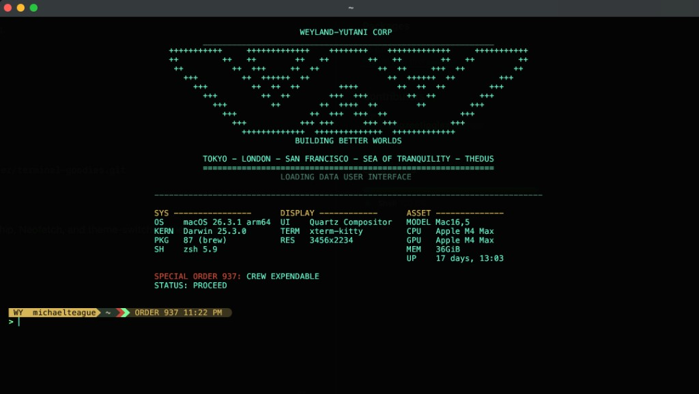
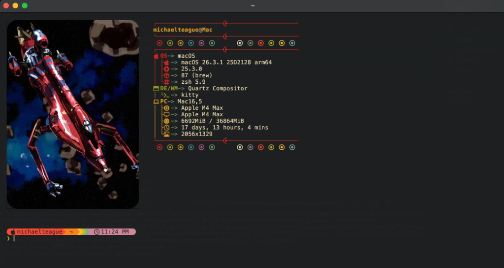

# Terminal Goodies

macOS terminal configuration and theme profiles.

## Prerequisites

Install [Homebrew](https://brew.sh) before running the installer.

## Install

```sh
git clone https://github.com/migzeetigglez/terminal-goodies.git
cd terminal-goodies/mac
./install.sh
```

The installer copies the macOS shell, Kitty, Starship, Neofetch, and theme-switching files into place.

## Theme References

Outlaw Star profile reference:



Alternate Outlaw Star reference:



## Themes

Available profiles:

- `outlawstar`
- `weyland`

Switch themes with:

```sh
terminal-theme outlawstar
terminal-theme weyland
```

The `terminal-theme` zsh wrapper reloads `~/.zshrc` and runs `neofetch` after a successful switch.
